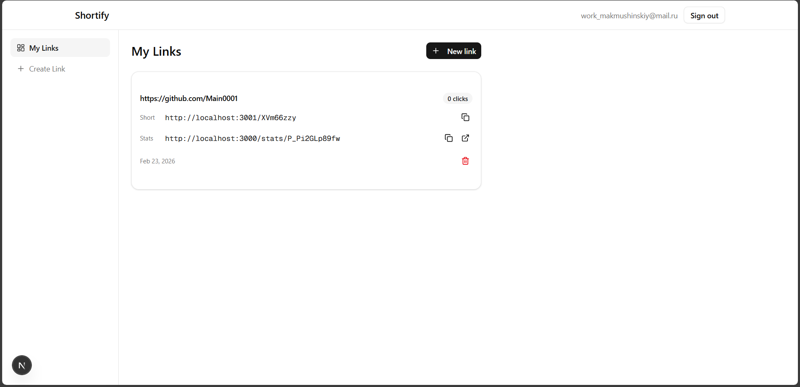
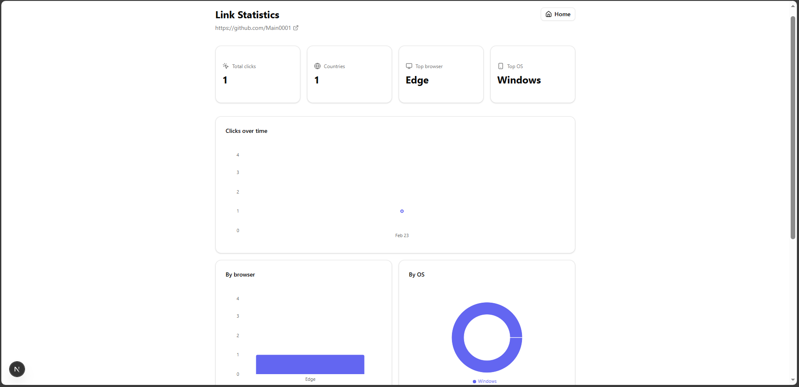

# Shortify — URL Shortener

FullStack-приложение для сокращения ссылок, а также просмотра статистики по переходам

## Цель:

Показать уровень владения современными технологиями веб-разработки, проектирования систем, моделирования данных.

## Что делает приложение:

### Предоставляет возможность сократить ссылку

### Предоставляет 2 ссылки, для перехода и для просмотра статистики переходов

### Позволяет посмотреть статистику переходов по сокращенной ссылке

Статистика собирает данные по количеству кликов, браузерам, странам, городам и ОС

## Технологии

Для сбора данных используется сервис [ip-api.com](https://ip-api.com/)

### Backend

- NestJS - ядро приложения
- PostgreSQL - база данных
- Prisma - для работы с базами данных
- JWT - для авторизации пользователя
- env-var - для работы с локальными переменными
- Axios - для создания запросов к сервису [ip-api.com](https://ip-api.com/)
- naniod - для генерации уникальных коротких ссылок

### Frontend

- Next.js - ядро приложения
- Redux - для контроля состояний приложения и передачи этих сосотояний между компонентами
- Axios - для создания api между frontend и backend
- Recharts - создание графиков на странице статистики
- Tailwind CSS - стили приложения
- Shadcn UI - красивые готовые компоненты приложения

## Требования

- Node.js 20+ (LTS)
- PostgreSQL 12+

## Использование

В приложении используется Shadcn UI.

Официальная документация - https://ui.shadcn.com/docs/installation

Для статистики используется Recharts

Официальная документация - https://recharts.github.io/en-US/guide/

## Запуск приложения

1. `git clone <repository-url>`

Для запуска необходимо выполнить инструкции ниже

### backend

1. `cd backend`
2. `npm install`
3. `npm start`

### frontend

1. `cd frontend`
2. `npm install`
3. `npm run dev`

Сервера в папке frontend и backend должны одновременно работать

Перейти по ссылке http://localhost:3000/
